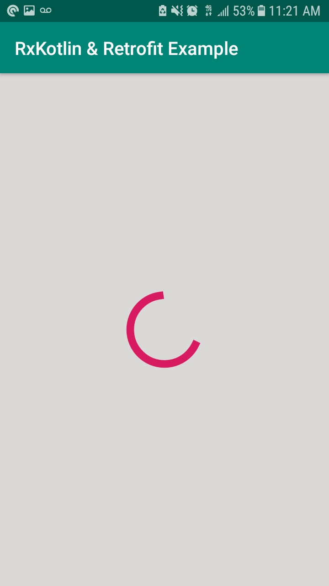
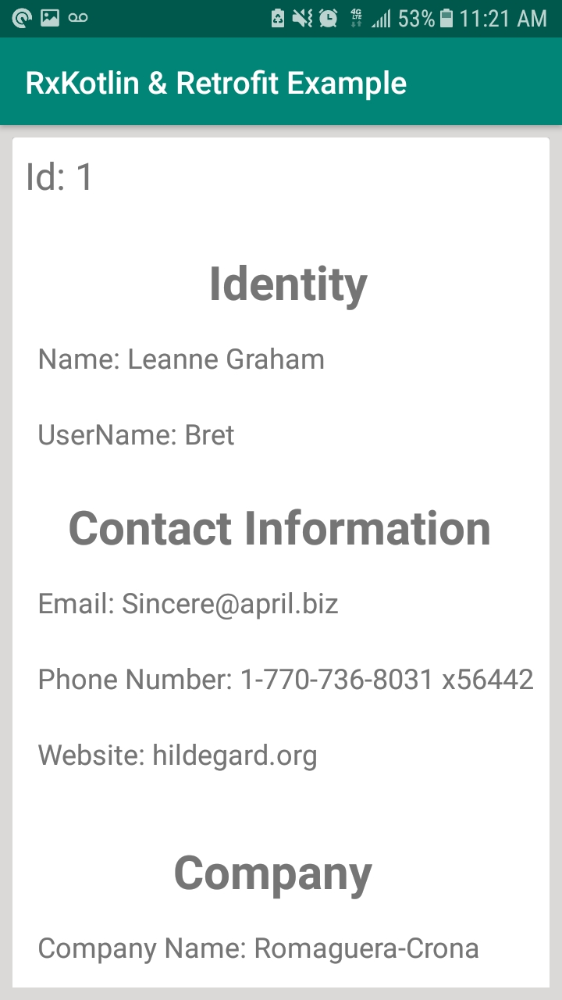
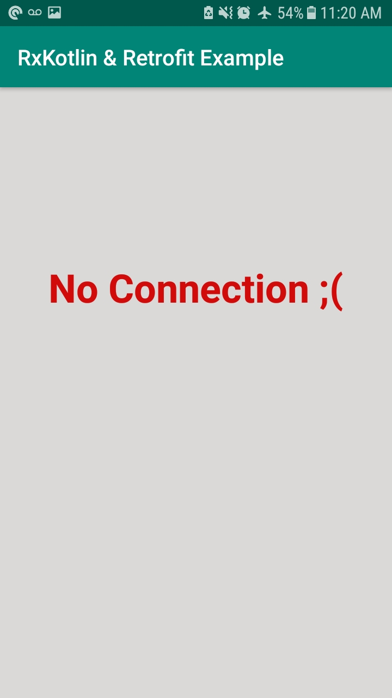

# RxKotlin-Retrofit-MVVM-Example
Fairly simple project I built once I felt confident in MVVM, RxJava, and Retrofit. The challenge of this project was understanding how all of these technologies and design patterns work together. 

  
   
   

## Installing
To install go to android studio -> file-> new-> project from version control-> Git-> paste in this url: https://github.com/That1guy17/RxKotlin-Retrofit-MVVM-Example

You can then install from android studio.

## Primarily Built With
* Retrofit
* RxKotlin 
* Lifecycle Libraries

## Contributing 
If you wish to contribute to this project email me first at takariharrison@gmail.com
